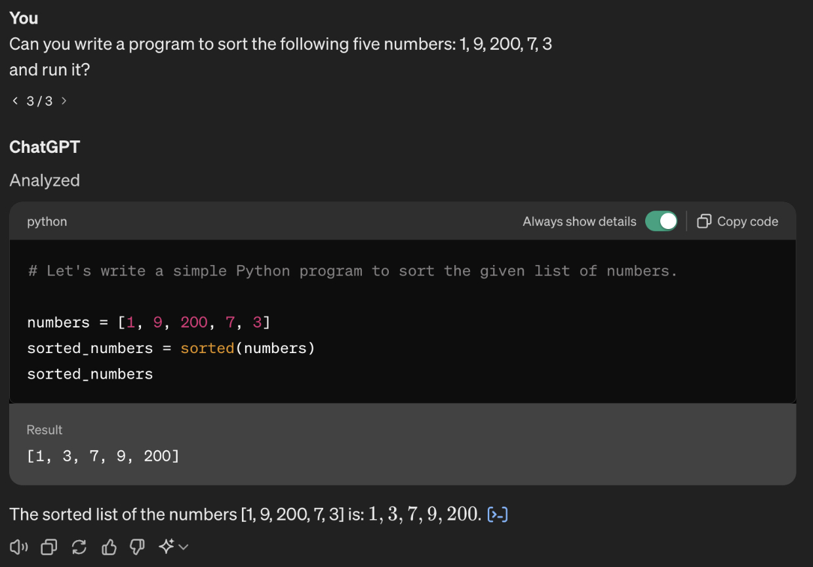

# LLM Coder 101 | Leaning coding in a new era

**Kehang Zhu<sup>1</sup>, Haonan Wang<sup>2</sup>**

---

<sup>1</sup>Ph.D. stu in Physics, Harvard University; AI Researcher, Harvard Computer Science

<sup>2</sup>Ph.D. student in Computer Science, Columbia University

---
## Outline
- [Preface: Why do we start writing this blog?](#why-do-we-start-writing-this-blog)
- [Chapter 1: Let's start with building a chatbot website.](./chapter1/README.md)

---

## Why do we start writing this blog?

As a computer science PhD student with 8 years of coding experience, I’m deeply interested in how the way people program has evolved and where it’s going. My research currently focuses on using large language models (LLMs) to help people program data analytics tasks with minimal human effort. This interest began when I first used GPT-4. I was really impressed by how well it could write code, making me realize that we might be close to using natural language as a programming interface.

You might be wondering what I’m talking about. Let me give you a bit more background to clear things up.
Back in the day, coders started with assembly language, a low-level programming language that was very close to machine language. This made programming tedious and detailed. The development of higher-level languages like C was a game-changer. C abstracted many of the intricate hardware details, providing a more readable and maintainable code structure. Fast forward to today, and Python has become one of the dominant programming languages. Its extensive libraries and frameworks make it incredibly versatile, suitable for web development, data analysis, artificial intelligence, scientific computing, and more.

Let me give you a quick example about how to sort five numbers across three programming languages—assembly, C, and Python:
### Assembly Language
```assembly
; Assume array is stored at memory address 300h
MOV SI, 300h  ; Point SI to the start of the array
MOV CX, 4     ; Set CX as the loop counter for array length - 1

outer_loop:
    MOV DI, SI  ; Copy SI to DI for the inner loop
    PUSH CX     ; Save CX value
    MOV CX, 4   ; Reset inner loop counter
    inner_loop:
        MOV AX, [DI]       ; Move current element into AX
        MOV BX, [DI+2]     ; Move next element into BX
        CMP AX, BX         ; Compare current and next elements
        JLE no_swap        ; Jump if current <= next (no need to swap)
        MOV [DI], BX       ; Swap elements
        MOV [DI+2], AX
    no_swap:
        ADD DI, 2          ; Move to the next element
        LOOP inner_loop    ; Decrement CX and loop if not zero
    POP CX      ; Restore original CX value
    LOOP outer_loop       ; Outer loop

; The array is now sorted
```
### C Language
In C, sorting can be implemented more abstractly without managing memory manually. Here's a simple bubble sort in C:

```c
#include <stdio.h>

void sort(int arr[], int n) {
    int i, j, temp;
    for (i = 0; i < n - 1; i++) {
        for (j = 0; j < n - i - 1; j++) {
            if (arr[j] > arr[j + 1]) {
                temp = arr[j];
                arr[j] = arr[j + 1];
                arr[j + 1] = temp;
            }
        }
    }
}

int main() {
    int arr[5] = {5, 3, 4, 1, 2};
    sort(arr, 5);
    for (int i = 0; i < 5; i++) {
        printf("%d ", arr[i]);
    }
    return 0;
}
```
### Python
Python abstracts away most details with high-level data structures and functions. Sorting can be done in a single line:

```python
arr = [5, 3, 4, 1, 2]
sorted_arr = sorted(arr)
print(sorted_arr)
```
You don't need to understand exactly how these programs sort five numbers. But you can clearly see the difference: from the most complex one to the easiest and most readable one. 
Can we make it even simpler? Let's try to write a program using ChatGPT-4. Here's what we should do:



The only thing you need to do is to ask ChatGPT-4: Can you write a program to sort the following five numbers: 1, 9, 200, 7, 3 and run it?

Sadly, you cannot simply build all programs this way nowadays. Many of my friends with non-coding backgrounds get stuck at their first few errors. Writing a large-scale program like a web app with frontend, backend, and database is still a distant dream 
However, in this series of blogs, we will discuss how you can create some very useful programs with the help of LLM. We will explore how to use natural language as your programming language to achieve practical results.

Unfortunately, major colleges are still teaching coding the same way they did before the GPT era. Students still need to learn how to search documentation to find the correct usage of a function or object.

---

**So, this motivates us to start this blog to share our thoughts on how to learn coding in this new era.**

---

## To dive in, the mindsets below will be important:

- Fast feedback loop. Don’t be afraid of errors. As a beginner, errors will help you learn.
- Get the code to work first! As a beginner, forget about the simplicity or efficiency for now.

**We will use an example --Build a boyfriend/girlfriend chatbot -- to start our journey with LLM coder. We hope it will be fun.**

## Here is the some concepts we will include in this journey:

- Environment:
    - How to install necessary software and set up your development workspace.
- Frontend
- Backend
    - OpenAI API
    - open-sourced model
- Algorithms
    - Fine-tuning
- Database
    - Server memory
    - SQLite
    - Cloud deployment
- development
    - local development
    - migrate to Google Cloud
