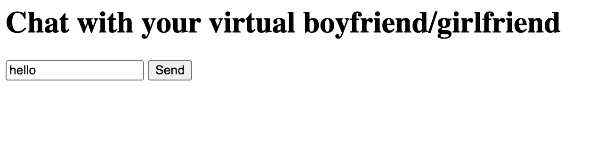
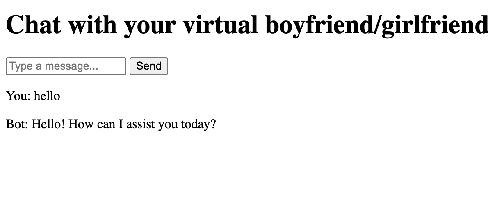

This guide will show you how a beginner can use ChatGPT-4o to build a chatbot website. I'll walk you through how to ask questions to ChatGPT-4o, providing an easy example to help beginners with basic knowledge about Python start programming with ChatGPT-4 and see what they can do.

For someone just starting out, the first thing to do is decide what you want to create. In this blog, our goal is to build a chatbot that can interact with the user like a boyfriend or girlfriend.

After setting our goal, the next step is to plan out the steps we need to follow. Let's start by asking ChatGPT-4o for help with this!

I started by asking ChatGPT-4:
```
I'm just starting out with programming, and I want to make a website where people can use the ChatGPT-4o API to create a boyfriend/girlfriend chatbot using Python. I only know that I want to use Python and that I want to develop on my 15-inch M2 MacBook Air, 2023. Can you teach me how to do this step by step?
```

Here’s what I received from ChatGPT-4:

Sure, here is the updated guide formatted as quotes:

> ### Step 1: Set Up Your Development Environment
> **Actions:**
> 1. Install Python:
>    - Your MacBook Air should come with Python pre-installed. Open the Terminal and type `python3 --version` to check. If it's not installed, you can download it from [python.org](https://www.python.org/).
> 2. Install a Code Editor:
>    - Use a code editor like Visual Studio Code. Download and install it from [here](https://code.visualstudio.com/).
> 3. Set Up a Virtual Environment:
>    - In your terminal, navigate to the directory where you want to store your project. Run:
>      ```bash
>      python3 -m venv myenv
>      source myenv/bin/activate
>      ```
>    - This creates and activates a virtual environment to manage your project dependencies.

> ### Step 2: Install Necessary Python Packages
> **Actions:**
> 1. Install Flask:
>    - Flask is a lightweight web framework for Python.
>      ```bash
>      pip install flask
>      ```
> 2. Install Requests:
>    - This will help you make API calls to the ChatGPT API.
>      ```bash
>      pip install requests
>      ```

> ### Step 3: Set Up the Flask Application
> **Actions:**
> 1. Create a Project Directory:
>    - Create a directory for your project and navigate into it:
>      ```bash
>      mkdir chatbot_project
>      cd chatbot_project
>      ```
> 2. Create Flask Application:
>    - Inside the `chatbot_project` directory, create a file named `app.py` with the following content:
>      ```python
>      from flask import Flask, request, jsonify
>      import requests
>
>      app = Flask(__name__)
>
>      @app.route('/')
>      def home():
>          return "Welcome to the Chatbot API!"
>
>      @app.route('/chat', methods=['POST'])
>      def chat():
>          user_input = request.json.get('message')
>          response = get_chatbot_response(user_input)
>          return jsonify(response)
>
>      def get_chatbot_response(user_input):
>          # Replace 'your_api_key_here' with your actual OpenAI API key
>          api_key = 'your_api_key_here'
>          headers = {
>              'Authorization': f'Bearer {api_key}',
>              'Content-Type': 'application/json'
>          }
>          data = {
>              'model': 'gpt-4',
>              'messages': [{'role': 'user', 'content': user_input}]
>          }
>          response = requests.post('https://api.openai.com/v1/chat/completions', headers=headers, json=data)
>          return response.json()
>
>      if __name__ == '__main__':
>          app.run(debug=True)
>      ```

> ### Step 4: Obtain OpenAI API Key
> **Actions:**
> 1. Sign Up for OpenAI:
>    - Go to the [OpenAI website](https://openai.com/) and sign up for an API key.
> 2. Replace the API Key:
>    - Replace `'your_api_key_here'` in `app.py` with your actual API key.

> ### Step 5: Run Your Flask Application
> **Actions:**
> 1. Run the Application:
>    - In your terminal, navigate to the `chatbot_project` directory and run:
>      ```bash
>      flask run
>      ```
>    - You should see output indicating that the Flask server is running.
> 2. Access the Application:
>    - Open your web browser and go to `http://127.0.0.1:5000/`. You should see the "Welcome to the Chatbot API!" message.

> ### Step 6: Create a Simple Frontend (Optional)
> **Actions:**
> 1. Create an HTML File:
>    - Create an `index.html` file in the `chatbot_project` directory with the following content:
>      ```html
>      <!DOCTYPE html>
>      <html>
>      <head>
>          <title>Chatbot</title>
>      </head>
>      <body>
>          <h1>Chat with your virtual boyfriend/girlfriend</h1>
>          <form id="chat-form">
>              <input type="text" id="user-input" placeholder="Type a message..." required>
>              <button type="submit">Send</button>
>          </form>
>          <div id="chat-log"></div>
>
>          <script>
>              const form = document.getElementById('chat-form');
>              const chatLog = document.getElementById('chat-log');
>
>              form.addEventListener('submit', async (event) => {
>                  event.preventDefault();
>                  const userInput = document.getElementById('user-input').value;
>                  const response = await fetch('/chat', {
>                      method: 'POST',
>                      headers: {
>                          'Content-Type': 'application/json'
>                      },
>                      body: JSON.stringify({ message: userInput })
>                  });
>                  const data = await response.json();
>                  const botMessage = data.choices[0].message.content;
>
>                  const userMessageElement = document.createElement('p');
>                  userMessageElement.textContent = 'You: ' + userInput;
>                  chatLog.appendChild(userMessageElement);
>
>                  const botMessageElement = document.createElement('p');
>                  botMessageElement.textContent = 'Bot: ' + botMessage;
>                  chatLog.appendChild(botMessageElement);
>
>                  document.getElementById('user-input').value = '';
>              });
>          </script>
>      </body>
>      </html>
>      ```
> 2. Serve the HTML File:
>    - Modify the `home` route in `app.py` to serve the HTML file:
>      ```python
>      @app.route('/')
>      def home():
>          return app.send_static_file('index.html')
>      ```
> 3. Create a Static Folder:
>    - Create a folder named `static` in the `chatbot_project` directory and move `index.html` into this folder.

> ### Step 7: Test Your Application
> **Actions:**
> 1. Run the Flask Application:
>    - Make sure your Flask application is running by using `flask run`.
> 2. Open in Browser:
>    - Open your web browser and navigate to `http://127.0.0.1:5000/`. You should see the chatbot interface where you can type messages and receive responses.

> ### Step 8: Deploy Your Application (Optional)
> **Actions:**
> 1. Choose a Hosting Service:
>    - Consider using services like Heroku, AWS, or PythonAnywhere to deploy your Flask application.
> 2. Follow Deployment Instructions:
>    - Each service has its own deployment instructions. Follow the steps provided by your chosen hosting service to deploy your Flask application.

> Congratulations! You've set up a basic web application that integrates with the ChatGPT API to create a virtual boyfriend/girlfriend chatbot. You can now expand and customize your application as you learn more about programming and web development.


This looks great! Let's use this guide as roadmap and start working on the project!

First, I ran `python3 --version` and got Python 3.10.8. Then, I downloaded Visual Studio Code and created a folder called `chatbot_app`. I navigated to the directory and ran:
```bash
python3 -m venv myenv
source myenv/bin/activate
```

Everything looks good to me. Now, I'm curious about how to check if I've done everything correctly. It might be better to check things as I go rather than waiting to test everything at the end. This way, I can catch any issues early. But, how can I do that?
Let's turn to my best mentor, ChatGPT-4o, once again:
```
Can you show me some straightforward ways to check that I've completed each step you gave me correctly?
```
And then I get:

> Certainly! Here are some straightforward ways to check that you've completed each step correctly:
> ### Step 1: Set Up Your Development Environment
> **Checkpoints:**
> 1. **Verify Python Installation**:
>    - Open Terminal and type `python3 --version`. You should see the Python version number.
>      ```bash
>      python3 --version
>      ```
> 2. **Verify Code Editor Installation**:
>    - Open Visual Studio Code from your Applications folder or by typing `code` in Terminal (if added to your PATH).
>      ```bash
>      code
>      ```
> 3. **Verify Virtual Environment Setup**:
>    - After activating the virtual environment, your Terminal prompt should change to show the environment name, e.g., `(myenv)`.
>      ```bash
>      source myenv/bin/activate
>      ```

> ### Step 2: Install Necessary Python Packages
> **Checkpoints:**
> 1. **Verify Flask Installation**:
>    - Run `pip show flask` in the terminal. You should see package information if Flask is installed.
>      ```bash
>      pip show flask
>      ```
> 2. **Verify Requests Installation**:
>    - Run `pip show requests` in the terminal. You should see package information if Requests is installed.
>      ```bash
>      pip show requests
>      ```

> ### Step 3: Set Up the Flask Application
> **Checkpoints:**
> 1. **Verify Project Directory Creation**:
>    - Check that the `chatbot_project` directory exists by running `ls` in the parent directory.
>      ```bash
>      ls
>      ```
> 2. **Verify `app.py` File Creation**:
>    - Check that `app.py` exists in the `chatbot_project` directory by running `ls`.
>      ```bash
>      ls chatbot_project
>      ```

> ### Step 4: Obtain OpenAI API Key
> **Checkpoints:**
> 1. **Verify OpenAI API Key Registration**:
>    - Log in to your OpenAI account and ensure you can see your API key.
> 2. **Verify API Key in `app.py`**:
>    - Open `app.py` and ensure the `api_key` variable contains your actual API key.

> ### Step 5: Run Your Flask Application
> **Checkpoints:**
> 1. **Verify Flask Server Running**:
>    - Run the Flask application and check the terminal output for a message like "Running on http://127.0.0.1:5000/".
>      ```bash
>      flask run
>      ```
> 2. **Verify Access to Application**:
>    - Open your web browser and navigate to `http://127.0.0.1:5000/`. You should see the "Welcome to the Chatbot API!" message.

> ### Step 6: Create a Simple Frontend (Optional)
> **Checkpoints:**
> 1. **Verify `index.html` File Creation**:
>    - Check that `index.html` exists in the `static` folder by running `ls`.
>      ```bash
>      ls chatbot_project/static
>      ```
> 2. **Verify HTML Served**:
>    - Open your web browser and navigate to `http://127.0.0.1:5000/`. You should see the chatbot interface.

> ### Step 7: Test Your Application
> **Checkpoints:**
> 1. **Verify Flask Application Running**:
>    - Ensure the Flask application is running by checking the terminal output.
>      ```bash
>      flask run
>      ```
> 2. **Verify Chatbot Interface**:
>    - Open your web browser and navigate to `http://127.0.0.1:5000/`. Type a message in the chatbot interface and ensure you receive a response.

> ### Step 8: Deploy Your Application (Optional)
> **Checkpoints:**
> 1. **Verify Hosting Service Account**:
>    - Log in to your chosen hosting service (e.g., Heroku, AWS, PythonAnywhere) and ensure your account is active.
> 2. **Verify Deployment**:
>    - Follow the deployment instructions for your chosen service. Once deployed, open the provided URL to check that your application is running online.

> These checkpoints should help you verify that each step has been completed correctly. If you encounter any issues, you can troubleshoot by referring to the specific step's instructions and ensuring all commands and configurations are correct.

I finished the first step and passed the check easily. But when I tried the second step, I hit an error: command not found: pip. It's time to dig in and see what's up! Let's head back to ChatGPT-4o again.

```
I tried to do the second step:
```bash
pip install flask
```
However, I received the error command not found: pip. What is happening here and what should I do?
```
and got

> ### Step 1: Verify Python Installation
> **Actions:**
> 1. **Check Python Version**:
>    ```bash
>    python3 --version
>    ```
>    - If Python is installed, you should see the version number. If not, you need to install Python.
> 2. **Install Python**:
>    - Download the latest version of Python from [python.org](https://www.python.org/downloads/).
>    - Run the installer and make sure to check the box that says "Add Python to PATH" during installation.

> ### Step 2: Ensure `pip` is Installed
> **Actions:**
> 1. **Check `pip` Version**:
>    ```bash
>    python3 -m pip --version
>    ```
>    - If `pip` is installed, you should see the version number. If you get an error, proceed to install `pip`.
> 2. **Install `pip`**:
>    - Download `get-pip.py` using `curl`:
>      ```bash
>      curl https://bootstrap.pypa.io/get-pip.py -o get-pip.py
>      ```
>    - Run the script with Python:
>      ```bash
>      python3 get-pip.py
>      ```

> ### Step 3: Add `pip` to PATH
> **Actions:**
> 1. **Find `pip` Installation Path**:
>    ```bash
>    which pip3
>    ```
>    - This should return a path like `/usr/local/bin/pip3`.
> 2. **Add Path to `.bash_profile` or `.zshrc`**:
>    - Open your `.bash_profile` or `.zshrc` file in a text editor. Which one you use depends on your shell (Bash or Zsh). You can check your shell with:
>      ```bash
>      echo $SHELL
>      ```
>    - For Bash (`.bash_profile`):
>      ```bash
>      nano ~/.bash_profile
>      ```
>    - For Zsh (`.zshrc`):
>      ```bash
>      nano ~/.zshrc
>      ```
> 3. **Add the Following Line**:
>    ```bash
>    export PATH=$PATH:/usr/local/bin
>    ```
> 4. **Save the File and Reload Your Profile**:
>    - Save the file (Ctrl + O, Enter, Ctrl + X to exit in Nano).
>    - Reload the profile:
>      ```bash
>      source ~/.bash_profile
>      ```
>      or
>      ```bash
>      source ~/.zshrc
>      ```

> ### Step 4: Verify `pip` Installation
> **Actions:**
> 1. **Check `pip` Version Again**:
>    ```bash
>    pip3 --version
>    ```
>    - If `pip` is correctly installed and added to your PATH, this should display the version number.

> ### Step 5: Install Flask
> **Actions:**
> 1. **Install Flask**:
>    ```bash
>    pip3 install flask
>    ```

> ### Summary
> By following these steps, you should be able to resolve the `command not found: pip` error and proceed with installing Flask. If you encounter further issues, please let me know!

I followed the steps one by one, and everything seems to be working pretty well. It looks like we should use pip3 instead of pip. Let's change the command `pip show requests` to `pip3 install requests`. And we should also change the check command to the corresponding `pip3` command:

> ### Step 2: Install Necessary Python Packages
> **Checkpoints:**
> 1. **Verify Flask Installation**:
>    - Run `pip show flask` in the terminal. You should see package information if Flask is installed.
>      ```bash
>      pip3 show flask
>      ```
> 2. **Verify Requests Installation**:
>    - Run `pip show requests` in the terminal. You should see package information if Requests is installed.
>      ```bash
>      pip3 show requests
>      ```

After finishing step 2, I quickly completed step 3 and passed the check. However, I encountered some confusion when I reached step 4. I logged into the [OpenAI website](https://openai.com/), but couldn't find the API key. Needing help, I turned to ChatGPT-4o again (I asked GPT-4o to use the web search function since the process for obtaining the API key might change frequently):

```
I cannot find the API key on the website. Can you tell me exactly where I should look using the web search?
```

> To obtain your OpenAI API key, follow these steps:
>
> 1. **Visit the OpenAI Website**:
>    - Go to the OpenAI website [here](https://platform.openai.com/) and log in to your account. If you don't have an account, you'll need to create one.
>
> 2. **Navigate to the API Keys Section**:
>    - Once logged in, click on your profile picture in the top-right corner of the dashboard. From the dropdown menu, select “View API keys”【23†source】【24†source】.
>
> 3. **Generate a New API Key**:
>    - In the API keys section, click the “Create new secret key” button. This will generate a new API key for you【24†source】.
>
> 4. **Copy and Save Your API Key**:
>    - Once the key is generated, you will see an option to copy it. Make sure to save this key securely, as it will not be shown again after you leave the page【23†source】.
>
> For more detailed guidance, you can refer to the OpenAI Help Center [here](https://help.openai.com/en/articles/4936850-where-do-i-find-my-openai-api-key)【21†source】. If you encounter any issues, clearing your browser cache or ensuring the correct copying of the API key might help【23†source】.
>
> By following these steps, you should be able to successfully obtain and use your OpenAI API key for your project.


It still didn't work, so I asked GPT-4o again: 
```
Can you search for the latest results?
```

And I got:

> To obtain your OpenAI API key, follow these updated steps:
>
> 1. **Visit the OpenAI Website**:
>    - Go to the OpenAI website [here](https://platform.openai.com/) and log in to your account. If you don't have an account, you'll need to create one.
>
> 2. **Navigate to the API Keys Section**:
>    - Once logged in, click on your profile picture in the top-right corner of the dashboard. From the dropdown menu, select “View API keys”. This will take you to the API key management page【32†source】【33†source】.
>
> 3. **Generate a New API Key**:
>    - On the API key management page, click the “Create new secret key” button. This will generate a new API key for you【32†source】.
>
> 4. **Copy and Save Your API Key**:
>    - Once the key is generated, copy it immediately and save it in a secure location, as it will not be displayed again after you leave the page. This key will grant you access to OpenAI's services, so it's important to keep it safe【32†source】【35†source】.
>
> For additional details, you can refer to the OpenAI Help Center [here](https://help.openai.com/en/articles/4936850-where-do-i-find-my-openai-api-key)【35†source】. If you encounter any issues, ensuring the correct copying of the API key or clearing your browser cache might help【33†source】.

Sometimes, you might still not get the correct answer—GPT-4o isn't always up-to-date with the latest changes, and the current model is still struggling with using web search results accurately. This time I got lucky, I found the guide at https://platform.openai.com/api-keys and successfully created my API key.

I successfully completed steps 4 and 5, but when I reached step 6, I encountered a new error:
```
Traceback (most recent call last):
  File "/usr/local/bin/flask", line 8, in <module>
    sys.exit(main())
  File "/usr/local/lib/python3.10/site-packages/flask/cli.py", line 1105, in main
    cli.main()
  File "/usr/local/lib/python3.10/site-packages/click/core.py", line 1078, in main
    rv = self.invoke(ctx)
  File "/usr/local/lib/python3.10/site-packages/click/core.py", line 1688, in invoke
    return _process_result(sub_ctx.command.invoke(sub_ctx))
  File "/usr/local/lib/python3.10/site-packages/click/core.py", line 1434, in invoke
    return ctx.invoke(self.callback, **ctx.params)
  File "/usr/local/lib/python3.10/site-packages/click/core.py", line 783, in invoke
    return __callback(*args, **kwargs)
  File "/usr/local/lib/python3.10/site-packages/click/decorators.py", line 92, in new_func
    return ctx.invoke(f, obj, *args, **kwargs)
  File "/usr/local/lib/python3.10/site-packages/click/core.py", line 783, in invoke
    return __callback(*args, **kwargs)
  File "/usr/local/lib/python3.10/site-packages/flask/cli.py", line 953, in run_command
    raise e from None
  File "/usr/local/lib/python3.10/site-packages/flask/cli.py", line 937, in run_command
    app: WSGIApplication = info.load_app()
  File "/usr/local/lib/python3.10/site-packages/flask/cli.py", line 339, in load_app
    app = locate_app(import_name, None, raise_if_not_found=False)
  File "/usr/local/lib/python3.10/site-packages/flask/cli.py", line 245, in locate_app
    __import__(module_name)
  File "/Users/xxx/Desktop/LLM_coder101/chatbot/chatbot_project/app.py", line 31, in <module>
    def home():
  File "/usr/local/lib/python3.10/site-packages/flask/sansio/scaffold.py", line 362, in decorator
    self.add_url_rule(rule, endpoint, f, **options)
  File "/usr/local/lib/python3.10/site-packages/flask/sansio/scaffold.py", line 47, in wrapper_func
    return f(self, *args, **kwargs)
  File "/usr/local/lib/python3.10/site-packages/flask/sansio/app.py", line 657, in add_url_rule
    raise AssertionError(
AssertionError: View function mapping is overwriting an existing endpoint function: home
```

I didn't know what was happening, so I went to GPT-4o and asked about the problem:

```
I get this error: {put the error message here}. Can you tell me what is happening and how I should deal with it?
```
And got:

> The error you are encountering indicates that there is a conflict with the `home` endpoint in your Flask application. This happens when there are multiple view functions trying to map to the same endpoint name. Let's resolve this step by step.
>
> ### Step 1: Check Your `app.py` for Duplicate Endpoints
> **Actions:**
> 1. **Open `app.py`** and check for any duplicate route decorators for the `home` function.
>
> Here is an example of what might be causing the conflict:
> ```python
> from flask import Flask, request, jsonify
> import requests
>
> app = Flask(__name__)
>
> @app.route('/')
> def home():
>     return "Welcome to the Chatbot API!"
>
> @app.route('/')
> def home():  # This duplicate definition will cause the conflict.
>     return app.send_static_file('index.html')
>
> @app.route('/chat', methods=['POST'])
> def chat():
>     user_input = request.json.get('message')
>     response = get_chatbot_response(user_input)
>     return jsonify(response)
>
> def get_chatbot_response(user_input):
>     api_key = 'your_api_key_here'
>     headers = {
>         'Authorization': f'Bearer {api_key}',
>         'Content-Type': 'application/json'
>     }
>     data = {
>         'model': 'gpt-4',
>         'messages': [{'role': 'user', 'content': user_input}]
>     }
>     response = requests.post('https://api.openai.com/v1/chat/completions', headers=headers, json=data)
>     return response.json()
>
> if __name__ == '__main__':
>     app.run(debug=True)
> ```
>
> ### Step 2: Remove Duplicate Endpoints
> **Actions:**
> 1. Ensure there is only one `@app.route('/')` decorator. Here’s how you can modify it:
> ```python
> from flask import Flask, request, jsonify
> import requests
>
> app = Flask(__name__)
>
> @app.route('/')
> def home():
>     return app.send_static_file('index.html')
>
> @app.route('/chat', methods=['POST'])
> def chat():
>     user_input = request.json.get('message')
>     response = get_chatbot_response(user_input)
>     return jsonify(response)
>
> def get_chatbot_response(user_input):
>     api_key = 'your_api_key_here'
>     headers = {
>         'Authorization': f'Bearer {api_key}',
>         'Content-Type': 'application/json'
>     }
>     data = {
>         'model': 'gpt-4',
>         'messages': [{'role': 'user', 'content': user_input}]
>     }
>     response = requests.post('https://api.openai.com/v1/chat/completions', headers=headers, json=data)
>     return response.json()
>
> if __name__ == '__main__':
>     app.run(debug=True)
> ```
>
> ### Step 3: Run the Application Again
> **Actions:**
> 1. After ensuring there are no duplicate routes, try running your Flask application again:
> ```bash
> flask run
> ```
>
> This should resolve the `AssertionError` and allow your Flask application to run without issues.
>
> If you encounter any other issues or have further questions, feel free to ask!

This answer quickly solved my problem—I had a duplicate home endpoint! I fixed it, and now `flask run` works perfectly.



I can see the index page, but when I typed "hello" and clicked "send," I got no response.

So I asked ChatGPT-4o:
```
I can see the index page, but when I typed "hello" and clicked "send," I got no response. Can you suggest some typical debugging steps so I can gather information to help locate the bug?
```
and got:
> To debug the issue where you are not getting a response after typing "hello" and clicking "send" on your Flask application, follow these typical debugging steps:
>
> ### Step 1: Check the Console for Errors
> **Actions:**
> 1. **Browser Console**:
>    - Open your web browser's developer tools (usually by pressing F12 or right-clicking on the page and selecting "Inspect").
>    - Go to the "Console" tab and check for any JavaScript errors. These errors can provide clues about what might be going wrong.
>
> 2. **Flask Server Logs**:
>    - Check the terminal or command prompt where your Flask server is running. Look for any error messages or tracebacks that occur when you try to send a message.
>
> ### Step 2: Verify API Request
> **Actions:**
> 1. **Check the Network Request**:
>    - In the browser's developer tools, go to the "Network" tab.
>    - Try sending a message again and look for the network request to `/chat`. Check the request payload and the response.
>    - Ensure that the request is correctly formatted and that you are getting a valid response from the server.
>
> ### Step 3: Debug Flask Route
> **Actions:**
> 1. **Print Debugging in Flask**:
>    - Add print statements in your Flask route to see if the route is being hit and if the correct data is being processed.
>    ```python
>    @app.route('/chat', methods=['POST'])
>    def chat():
>        user_input = request.json.get('message')
>        print(f"Received message: {user_input}")
>        response = get_chatbot_response(user_input)
>        print(f"Response: {response}")
>        return jsonify(response)
>    ```
>
> 2. **Check Response Format**:
>    - Ensure the response from the ChatGPT API is correctly formatted before sending it back to the client.
>    ```python
>    def get_chatbot_response(user_input):
>        api_key = 'your_api_key_here'
>        headers = {
>            'Authorization': f'Bearer {api_key}',
>            'Content-Type': 'application/json'
>        }
>        data = {
>            'model': 'gpt-4',
>            'messages': [{'role': 'user', 'content': user_input}]
>        }
>        response = requests.post('https://api.openai.com/v1/chat/completions', headers=headers, json=data)
>        print(f"API response: {response.json()}")
>        return response.json()
>    ```
>
> ### Step 4: Verify API Key and Configuration
> **Actions:**
> 1. **Check API Key**:
>    - Ensure that your API key is correct and has not expired. Verify it by making a direct API call using a tool like Postman or curl.
>
> 2. **API Rate Limits**:
>    - Check if you are hitting any rate limits or if there are any issues with your OpenAI account.
>
> ### Step 5: Frontend Debugging
> **Actions:**
> 1. **Check JavaScript Code**:
>    - Ensure that your JavaScript code correctly handles the response from the server and updates the DOM.
>    ```javascript
>    const form = document.getElementById('chat-form');
>    const chatLog = document.getElementById('chat-log');
>
>    form.addEventListener('submit', async (event) => {
>        event.preventDefault();
>        const userInput = document.getElementById('user-input').value;
>        const response = await fetch('/chat', {
>            method: 'POST',
>            headers: {
>                'Content-Type': 'application/json'
>            },
>            body: JSON.stringify({ message: userInput })
>        });
>        const data = await response.json();
>        const botMessage = data.choices[0].message.content;
>
>        const userMessageElement = document.createElement('p');
>        userMessageElement.textContent = 'You: ' + userInput;
>        chatLog.appendChild(userMessageElement);
>
>        const botMessageElement = document.createElement('p');
>        botMessageElement.textContent = 'Bot: ' + botMessage;
>        chatLog.appendChild(botMessageElement);
>
>        document.getElementById('user-input').value = '';
>    });
>    ```
>
> ### Step 6: Test API Endpoint Independently
> **Actions:**
> 1. **Use Postman or curl**:
>    - Test the `/chat` endpoint independently using Postman or curl to ensure that it is working correctly and returning the expected response.
>    ```bash
>    curl -X POST http://127.0.0.1:5000/chat -H "Content-Type: application/json" -d '{"message": "hello"}'
>    ```
>
> By following these steps, you should be able to gather enough information to pinpoint the issue and fix it. If you still face problems, please share any specific errors or logs you encounter.

This is a long answer, but let's try to tackle it from the very beginning. I started by looking at the browser's developer console and found an error at this line: `const botMessage = data.choices[0].message.content;`.

So I asked:
```
I checked my browser's developer console and found this error: `const botMessage = data.choices[0].message.content;`. What could be the possible problems?
```

and got:
> The error `const botMessage = data.choices[0].message.content;` in your browser's developer console suggests that there might be an issue with the structure of the JSON response returned from your Flask backend. Specifically, it indicates that the response does not have a `choices` array, or that `choices[0]` does not have a `message` object with a `content` property.
>
> Here are some possible problems and steps to debug this issue:
>
> ### Possible Problems
> 1. **Incorrect API Response Structure**:
>    - The response from the ChatGPT API might not have the expected structure. This could be due to a change in the API, an error in the request, or an issue with the API key.
>
> 2. **Empty or Invalid Response**:
>    - The API might return an empty or error response, which does not contain the `choices` array or `message` object.
>
> ### Debugging Steps
> 1. **Print the API Response**:
>    - Modify the `get_chatbot_response` function to print the entire API response. This will help you see the actual structure of the response.
>    ```python
>    def get_chatbot_response(user_input):
>        api_key = 'your_api_key_here'
>        headers = {
>            'Authorization': f'Bearer {api_key}',
>            'Content-Type': 'application/json'
>        }
>        data = {
>            'model': 'gpt-4',
>            'messages': [{'role': 'user', 'content': user_input}]
>        }
>        response = requests.post('https://api.openai.com/v1/chat/completions', headers=headers, json=data)
>        print(response.json())  # Add this line to print the response
>        return response.json()
>    ```
>
> 2. **Check the Response in Flask Logs**:
>    - After adding the print statement, run your Flask application and check the terminal logs when you send a message from the frontend. Look for the printed API response and verify its structure.
>
> 3. **Update Frontend JavaScript**:
>    - Based on the actual response structure, update your JavaScript code to correctly access the desired data. For example, if the response structure is different, you may need to adjust how you extract `botMessage`.
>    ```javascript
>    form.addEventListener('submit', async (event) => {
>        event.preventDefault();
>        const userInput = document.getElementById('user-input').value;
>        const response = await fetch('/chat', {
>            method: 'POST',
>            headers: {
>                'Content-Type': 'application/json'
>            },
>            body: JSON.stringify({ message: userInput })
>        });
>        const data = await response.json();
>        console.log(data);  // Add this line to see the response in the console
>        
>        // Adjust the following line based on the actual structure of `data`
>        const botMessage = data.choices[0]?.message?.content || "No response from API";
>        
>        const userMessageElement = document.createElement('p');
>        userMessageElement.textContent = 'You: ' + userInput;
>        chatLog.appendChild(userMessageElement);
>
>        const botMessageElement = document.createElement('p');
>        botMessageElement.textContent = 'Bot: ' + botMessage;
>        chatLog.appendChild(botMessageElement);
>
>        document.getElementById('user-input').value = '';
>    });
>    ```
>
> 4. **Handle API Errors Gracefully**:
>    - Ensure your backend handles API errors and returns a proper response to the frontend. For example, you can return an error message if the API call fails.
>    ```python
>    @app.route('/chat', methods=['POST'])
>    def chat():
>        user_input = request.json.get('message')
>        try:
>            response = get_chatbot_response(user_input)
>            return jsonify(response)
>        except Exception as e:
>            return jsonify({'error': str(e)})
>    ```
>
> ### Step 4: Verify API Key and Configuration
> 1. **Check API Key**:
>    - Ensure that your API key is correct and has not expired. Verify it by making a direct API call using a tool like Postman or curl.
>
> 2. **API Rate Limits**:
>    - Check if you are hitting any rate limits or if there are any issues with your OpenAI account.
>
> ### Step 5: Test API Endpoint Independently
> 1. **Use Postman or curl**:
>    - Test the `/chat` endpoint independently using Postman or curl to ensure that it is working correctly and returning the expected response.
>    ```bash
>    curl -X POST http://127.0.0.1:5000/chat -H "Content-Type: application/json" -d '{"message": "hello"}'
>    ```
>
> By following these steps, you should be able to gather enough information to pinpoint the issue and fix it. If you still face problems, please share any specific errors or logs you encounter.

I encountered this error when I added a log to the Python script:
```
{'error': {'message': 'You exceeded your current quota, please check your plan and billing details. For more information on this error, read the docs: https://platform.openai.com/docs/guides/error-codes/api-errors.', 'type': 'insufficient_quota', 'param': None, 'code': 'insufficient_quota'}}
```

Oops, it looks like I have a quota problem. Let me ask how to solve it:

```
I received this error from the Python backend:

{'error': {'message': 'You exceeded your current quota, please check your plan and billing details. For more information on this error, read the docs: https://platform.openai.com/docs/guides/error-codes/api-errors.', 'type': 'insufficient_quota', 'param': None, 'code': 'insufficient_quota'}}

How should I solve it?
```

> The error message indicates that you have exceeded your current quota for the OpenAI API. To resolve this issue, you need to check your plan and billing details. Here are the steps you can take to address this:
>
> ### Step 1: Check Your OpenAI API Usage
> **Actions:**
> 1. **Log in to OpenAI Platform**:
>    - Go to the [OpenAI Platform](https://platform.openai.com/) and log in to your account.
>
> 2. **Navigate to Usage**:
>    - Click on your profile picture in the top-right corner and select "Usage" from the dropdown menu. This will show you your current usage and quota.
>
> ### Step 2: Upgrade Your Plan
> **Actions:**
> 1. **Review Your Current Plan**:
>    - Go to the [Billing](https://platform.openai.com/account/billing) section on the OpenAI Platform to see your current plan details.
>
> 2. **Upgrade Your Plan**:
>    - If you have exceeded your quota, you may need to upgrade your plan. You can do this from the Billing section. Choose a plan that suits your usage needs.
>
> ### Step 3: Add Billing Information
> **Actions:**
> 1. **Add Payment Method**:
>    - Ensure that you have added a valid payment method to your account. You can do this from the Billing section by clicking on "Add Payment Method".
>
> 2. **Set Up Billing**:
>    - Follow the instructions to set up billing and ensure your account is in good standing.
>
> ### Step 4: Verify Quota Increase
> **Actions:**
> 1. **Check for Quota Increase**:
>    - After upgrading your plan or adding billing information, check if your quota has been increased. This can be verified in the Usage section.
>
> 2. **Retry Your Request**:
>    - Once you have confirmed the quota increase, try running your Flask application again to see if the issue is resolved.
>
> ### Handling the Error Gracefully
> **Actions:**
> - To ensure a better user experience, handle the error gracefully in your Flask application. Modify your `/chat` endpoint to handle insufficient quota errors:
> ```python
> @app.route('/chat', methods=['POST'])
> def chat():
>     user_input = request.json.get('message')
>     try:
>         response = get_chatbot_response(user_input)
>         if 'error' in response:
>             return jsonify({'error': response['error']['message']})
>         return jsonify(response)
>     except Exception as e:
>         return jsonify({'error': str(e)})
>
> def get_chatbot_response(user_input):
>     api_key = 'your_api_key_here'
>     headers = {
>         'Authorization': f'Bearer {api_key}',
>         'Content-Type': 'application/json'
>     }
>     data = {
>         'model': 'gpt-4',
>         'messages': [{'role': 'user', 'content': user_input}]
>     }
>     response = requests.post('https://api.openai.com/v1/chat/completions', headers=headers, json=data)
>     return response.json()
> ```
>
> ### Summary
> By following these steps, you should be able to address the quota issue and ensure that your Flask application can successfully make API calls to OpenAI. If the issue persists, contact OpenAI support for further assistance.
>
> For more information on this error, you can refer to the [OpenAI API error documentation](https://platform.openai.com/docs/guides/error-codes/api-errors).

I finally found that the issue was due to having no credits in my account!




 